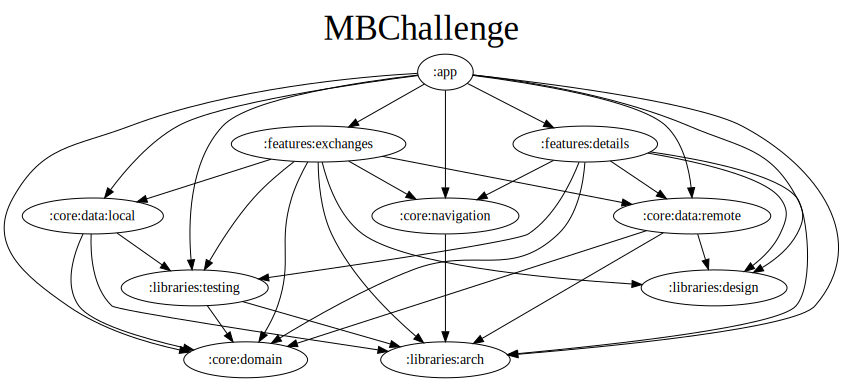

# MBChallenge

## About the Project

This project involves creating an application to query exchanges using the [CoinAPI.io](https://www.coinapi.io/). The app lists available exchanges and provides specific details about each, such as name, ID, and trading volume.

## Screens


## Features

- **List Screen**: Displays a list of exchanges with the following information:
    - Exchange Name
    - Exchange ID
    - 24-hour Trading Volume (USD)
- **Detail Screen**: Shows detailed information about an exchange when an item is selected from the list.
- **HTTP Error Handling**: The app handles HTTP errors as specified in the [CoinAPI documentation](https://docs.coinapi.io/market-data/rest-api/#http-errors), as well as generic errors and network issues.

| Error Code | Meaning                                                                 |
|------------|-------------------------------------------------------------------------|
| 400        | Bad Request -- There is something wrong with your request                |
| 401        | Unauthorized -- Your API key is wrong                                    |
| 403        | Forbidden -- Your API key doesn't have enough privileges to access this resource |
| 429        | Too many requests -- You have exceeded your API key rate limits          |
| 550        | No data -- You requested specific single item that we don't have at this moment |

## API Credentials

To use this app, you need an API key from [CoinAPI.io](https://www.coinapi.io/). This key is securely managed using the `secrets-gradle-plugin`. If the `secrets/apiKey.properties` file is missing, fallback values from `default.properties` will be used.

For more information and to obtain an API key, visit [here](https://www.coinapi.io/get-free-api-key?product_id=market-data-api).

## Setting Up the Project with Your CoinAPI Key

1. **Ensure the `default.properties` File is Configured**:
    - In the root directory of the project, ensure that there is a `default.properties` file with default values, including a placeholder for the [CoinAPI Key](https://www.coinapi.io/get-free-api-key?product_id=market-data-api).

   Example `default.properties`:
   ```properties
   COIN_API_KEY=*********************************
   ```

   Replace the placeholder with your actual API key. It should look like this:
   ```properties
   COIN_API_KEY=XXXXXXXX-XXXX-XXXX-XXXX-XXXXXXXXXXXX
   ```
    - The placeholder `XXXXXXXX-XXXX-XXXX-XXXX-XXXXXXXXXXXX` will be used during the build process if no real key is provided.

### Important Notes

- **Security**: Make sure to exclude files containing sensitive information, such as API keys, from version control to protect your credentials.

By following these steps, you ensure that the project builds successfully in all environments.

## How to Run the Project

1. Clone the repository to your local machine.
2. Insert your API key as described above.
3. Open the project in Android Studio and compile.

### Development Environment

- Android Studio Koala | 2024.1.1 Patch 1
- Build #AI-241.18034.62.2411.12071903
- Java JDK 17

## Technologies Used in This Project

### Module Dependencies

- [Modularization](https://developer.android.com/topic/modularization)



### Testing (Unit, Integration, Instrumentation)

- **[Espresso](https://developer.android.com/training/testing/espresso)**: Used for UI testing to ensure the app's user interface behaves as expected.
- **[Mockk](https://mockk.io/ANDROID.html)**: Employed for unit, integration, and instrumentation tests to mock dependencies and isolate the test scenarios.
- **[Robot Pattern](https://jakewharton.com/testing-robots/)**: A testing pattern used to improve test readability and maintainability by encapsulating interactions with the UI.

#### Integration Test Approach

> **For this project**, I opted for an integrated testing approach in the data layer to avoid redundant unit tests for each implementation.
> While unit tests are effective for the domain and presentation layers, they can become repetitive when testing data interactions.
>
> By adopting the Repository Pattern, I perform integrated tests that cover the entire data flow, from the data source (API or DAO) to the repository:
> `RepositoryImpl -> DataSource -> Source API (remote) or DAO (local)`.
> This ensures the correctness of the data flow by validating end-to-end data retrieval and error handling.
> This approach reduces unnecessary tests and enhances system reliability by focusing on complete data flows rather than isolated components.


### Dependency Injection

- [Koin](https://insert-koin.io/) - Dependency Injection Framework

### Presentation Pattern

- [MVVM pattern](https://en.wikipedia.org/wiki/Model%E2%80%93view%E2%80%93viewmodel)
- [MVI pattern](https://folio3.com/blog/introduction-to-mvi-architecture-in-android/)

### Architecture

- [Clean Architecture](https://blog.cleancoder.com/uncle-bob/2012/08/13/the-clean-architecture.html)

### Design System
The project includes a comprehensive in-house design system named **Pluto**, implemented within the `libraries/design` module. 
**Pluto** centralizes all UI/UX design elements and components, ensuring a consistent and cohesive user experience throughout the application.

## Credits

Credit to [Mercado Bitcoin](https://github.com/mercadobitcoin/querosermb) for the challenge requirements.
